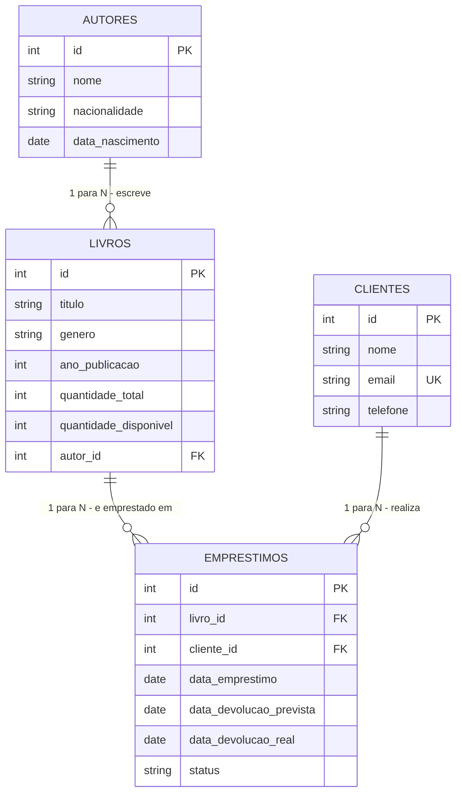
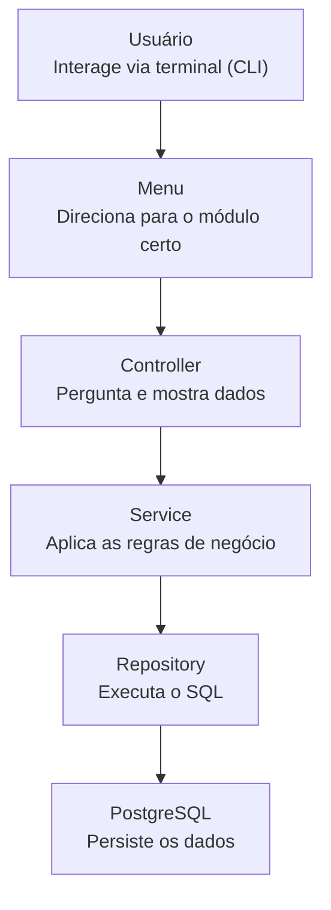

# 📚 BookStore Manager CLI

Aplicação de linha de comando (CLI) para gerenciamento de uma livraria, desenvolvida como projeto final do Módulo 01 do curso de Desenvolvedor(a) Back-End Node. Permite administrar autores, livros, clientes e empréstimos, utilizando o PostgreSQL como mecanismo de persistência dos dados.

## 🎯 Objetivo

Consolidar os conhecimentos de Node.js, TypeScript, Programação Orientada a Objetos, programação assíncrona, arquitetura em camadas e modelagem de banco de dados relacional, entregando uma aplicação próxima da realidade de um sistema corporativo de pequeno porte.

A aplicação é capaz de:

- gerenciar autores, livros, clientes e empréstimos;
- persistir informações em um banco de dados PostgreSQL;
- aplicar regras de negócio durante as operações do sistema;
- realizar consultas relacionais utilizando SQL;
- gerar relatórios gerenciais a partir dos dados armazenados.

## 🧱 Tecnologias utilizadas

| Tecnologia                  | Uso no projeto                                                       |
| --------------------------- | -------------------------------------------------------------------- |
| **Node.js + TypeScript**    | Linguagem e runtime da aplicação                                     |
| **PostgreSQL**              | Banco de dados relacional                                            |
| **Docker / Podman Compose** | Ambiente isolado e reprodutível do banco de dados _(opcional)_       |
| **pg (node-postgres)**      | Cliente PostgreSQL usado nas queries SQL                             |
| **readline-sync**           | Construção dos menus e formulários interativos no terminal           |
| **dotenv**                  | Carregamento de variáveis de ambiente a partir do `.env`             |
| **tsx**                     | Execução do TypeScript em desenvolvimento, sem etapa de build manual |
| **ES Modules (NodeNext)**   | Padrão moderno de import/export do Node.js/TypeScript                |

> 💡 O projeto utiliza ES Modules nativos (`"type": "module"` + `moduleResolution: NodeNext`), o padrão moderno de import/export do Node.js/TypeScript.

## ✅ Requisitos para execução

- Node.js 18 ou superior
- npm
- PostgreSQL 14 ou superior **ou** Docker/Podman com suporte a Compose

## ⚙️ Instalação

1. Clone o repositório:

   ```bash
   git clone https://github.com/DayanadoValle/bookstore-manager-cli.git
   cd bookstore-manager-cli
   ```

2. Instale as dependências (o `.env` é criado automaticamente a partir do `.env.example`, via script `postinstall`):

   ```bash
   npm install
   ```

   > 💡 Se o `.env` já existir, o script não sobrescreve — seguro rodar `npm install` quantas vezes quiser.

## 🗄️ Configuração do banco de dados

Existem **duas formas** de configurar o banco de dados. Escolha a que preferir — ambas funcionam com a mesma aplicação, sem nenhuma diferença no código.

### 🅱️ Opção 1 — Docker ou Podman Compose

Use esta opção se você tem Docker ou Podman instalado.
O banco de dados sobe já com as tabelas criadas automaticamente, sem precisar rodar o script manualmente.

1. Não é necessário editar o `.env` — os valores padrão do `.env.example` já são usados pelo `docker-compose.yml` para criar o banco:


2. Suba o banco de dados:

   ```bash
   docker compose up -d
   ```

   ou, utilizando Podman:

   ```bash
   podman compose up -d
   ```

3. Comandos úteis do dia a dia:

   ```bash
   docker compose stop     # desliga o banco, mantendo os dados
   docker compose start    # religa o banco
   docker compose down -v  # remove container e dados (recomeça do zero)
   ```

> 💡 O arquivo `docker-compose.yml` só é utilizado se você rodar algum comando `docker compose` / `podman compose`. Se você optar pela Opção 2 (manual), esse arquivo simplesmente não é acionado.

### 🅰️ Opção 2 — PostgreSQL instalado manualmente

Use esta opção se você já tem o PostgreSQL instalado diretamente no seu sistema operacional.

1. Crie o banco de dados:

   ```sql
   CREATE DATABASE bookstore_manager;
   ```

2. Execute o script disponível em `src/database/schema.sql` para criar as tabelas, relacionamentos e dados iniciais de exemplo:

   ```bash
   psql -U <usuario> -d bookstore_manager -f src/database/schema.sql
   ```

3. Abra o arquivo `.env` e preencha com as credenciais reais do seu banco PostgreSQL:

   ```env
   DB_HOST=localhost
   DB_PORT=5432
   DB_USER=postgres
   DB_PASSWORD=sua_senha
   DB_NAME=bookstore_manager
   ```

## ▶️ Execução

Após configurar o banco de dados (por qualquer uma das duas opções acima), rode a aplicação:

Em ambiente de desenvolvimento:

```bash
npm run dev
```

Ou, para compilar o projeto e executar a versão compilada:

```bash
npm run build
npm start
```

## 🗺️ Diagrama Entidade-Relacionamento (ER)



Todos os relacionamentos são **1 para N** (um autor tem vários livros, um livro pode ter vários empréstimos ao longo do tempo, um cliente pode ter vários empréstimos). Não há relacionamentos N:N neste modelo — cada livro está vinculado a um único autor, conforme exigido pelo escopo do projeto.

## 🏗️ Arquitetura do projeto

O projeto segue uma arquitetura organizada em camadas, promovendo a separação de responsabilidades:



| Camada           | Responsabilidade                                                               |
| ---------------- | ------------------------------------------------------------------------------ |
| **Main**         | Inicia a aplicação, estabelece a conexão com o banco e inicia o menu principal |
| **Menus**        | Organiza a navegação entre os módulos do sistema                               |
| **Controllers**  | Interagem com o usuário via terminal, capturam entradas e acionam os Services  |
| **Services**     | Implementam as regras de negócio e validações da aplicação                     |
| **Repositories** | Executam os comandos SQL de acesso ao banco de dados                           |
| **Models**       | Representam as entidades do sistema por meio de classes e interfaces tipadas   |
| **Database**     | Centraliza a conexão com o PostgreSQL e o script de criação do banco           |
| **Utils**        | Concentra funções auxiliares reutilizáveis (validações, formatação, erros)     |

## 📁 Estrutura de pastas

```
bookstore-manager-cli/
├── src/
│   ├── controllers/
│   │   ├── AutorController.ts
│   │   ├── LivroController.ts
│   │   ├── ClienteController.ts
│   │   ├── EmprestimoController.ts
│   │   └── RelatorioController.ts
│   ├── services/
│   │   ├── AutorService.ts
│   │   ├── LivroService.ts
│   │   ├── ClienteService.ts
│   │   ├── EmprestimoService.ts
│   │   └── RelatorioService.ts
│   ├── repositories/
│   │   ├── AutorRepository.ts
│   │   ├── LivroRepository.ts
│   │   ├── ClienteRepository.ts
│   │   ├── EmprestimoRepository.ts
│   │   └── RelatorioRepository.ts
│   ├── models/
│   │   ├── Autor.ts
│   │   ├── Livro.ts
│   │   ├── Cliente.ts
│   │   └── Emprestimo.ts
│   ├── database/
│   │   ├── connection.ts
│   │   └── schema.sql
│   ├── utils/
│   │   ├── AppError.ts
│   │   └── validadores.ts
│   ├── menus/
│   │   └── menuPrincipal.ts
│   └── main.ts
├── scripts/
│   └── setup.js
├── .env.example
├── .gitignore
├── docker-compose.yml
├── package.json
├── tsconfig.json
└── README.md
```

## 🚀 Funcionalidades implementadas

### Autores

- Cadastrar, listar, consultar por id, atualizar e remover autores.

### Livros

- Cadastrar, listar, consultar, atualizar e remover livros.
- Cada livro é obrigatoriamente vinculado a um autor previamente cadastrado.

### Clientes

- Cadastrar, listar, consultar, atualizar e remover clientes.
- Validação de e-mail e impedimento de cadastro duplicado.

### Empréstimos

- Registrar empréstimo de um livro para um cliente, validando existência de livro/cliente e disponibilidade em estoque.
- Impede que um cliente registre um novo empréstimo enquanto já tiver outro em aberto.
- Impede o registro de empréstimo com data de devolução prevista no passado.
- Registrar devolução, atualizando automaticamente a quantidade disponível do livro.
- Consultar empréstimos, exibindo livro, cliente, datas e indicação de atraso (🔴 atrasado / status ativo).

### Relatórios

- Livros disponíveis.
- Livros emprestados no momento.
- Livros cadastrados por autor.
- Quantidade de empréstimos por livro.
- Clientes com empréstimos ativos, com indicação de situação (🔴 Atrasado / 🟢 No prazo).

### Tratamento de erros

A aplicação valida e trata, sem interromper a execução:

- autor/livro/cliente/empréstimo inexistente;
- livro sem disponibilidade para empréstimo;
- cliente que já possui um empréstimo em aberto;
- data de devolução prevista no passado;
- e-mail de cliente duplicado;
- remoção de registros com vínculos ativos (ex.: autor com livros, livro/cliente com empréstimos).

## 💻 Exemplo de utilização

```
=======================================
   📚  BOOKSTORE MANAGER CLI  📚
=======================================
1. Autores
2. Livros
3. Clientes
4. Empréstimos
5. Relatórios
0. Encerrar aplicação
Escolha uma opção: 1

===== MENU AUTORES =====
1. Cadastrar autor
2. Listar autores
3. Consultar autor por id
4. Atualizar autor
5. Remover autor
0. Voltar ao menu principal
Escolha uma opção: 1
Nome do autor: George Orwell
✅ Autor cadastrado com sucesso! (id: 4)
```

## 📋 Link do Kanban

👉 [Acesse o Kanban do Projeto](https://github.com/users/DayanadoValle/projects/6/views/1)


## 📺 Demonstração em Vídeo

Confira o funcionamento completo do sistema e do loop de menus assistindo ao vídeo demonstrativo:
👉 [Assista ao vídeo de demonstração do projeto](#)


**Autor:** [Dayana do Valle](https://github.com/DayanadoValle)